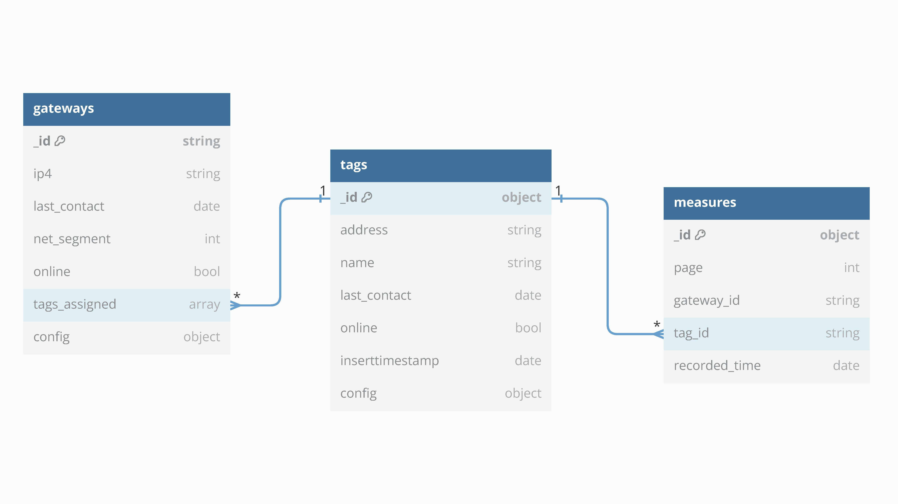

```{r setup, include=FALSE}
knitr::opts_chunk$set(echo = FALSE, cache=FALSE, messages=FALSE, warning=FALSE, 
                      attr.source='.numberLines', singlespacing = TRUE)
fhswf::fhswf_hooks()

# Load Packages
library(fhswf)
library(ggplot2)
```

# Einleitung

Das Ziel dieser Ausarbeitung ist einen Anwendungsfall für eine Dokumentendatenbank, im Speziellen MongoDB, aufzuzeigen. Hierzu wurde ein Docker-Container bereitgestellt, welcher Gateways, Ruuvi-Tags und Measurements simuliert. Die Gateways sind dabei als fest verankerte Positionen im Raum anzusehen, während die Tags bewegliche Objekte sind, die zum jeweils nächstgelegenen Gateway eine Verbindung herstellen und die regelmäßig Messungen erzeugen.

Die Ausarbeitung beginnt mit einer allgemeinen Einführung in MongoDB, der Datenbankstruktur und den Funktionen und Nutzen einer Dokumentendatenbank. Anschließend erfolgt die Darstellung eines Anwendungsfalls, welcher als Basis für die weiteren Implementierungssschritte dient. Gefolgt wird der Anwendungsfall von der daraus abgeleiteten Datenbankstruktur und der Python-Applikation, mit der Daten in die Datenbank eingespielt werden. Um im Anschluss aufzuzeigen, wie die Daten aus der Datenbank abgefragt werden, folgt ein allgemeiner Teil zur Datenbankabfrage in MongoDB und spezifische Datenvisualisierungen auf den innerhalb des Projekts in der Datenbank gespeicherten Daten. Abschließend erfolgt ein Fazit mit den Herausforderungen und möglichen Anpassungen an der Implementierung.

\newpage

# Einführung in MongoDB

MongoDB ist eine Open-Source-NoSQL-Datenbank, die auf nichtrelationalen Prinzipien aufbaut. Diese Datenbank ist flexibel und kann sowohl strukturierte, als auch unstrukturierte Daten verarbeiten. Sie ist dokumentenorientiert und in einer unstrukturierten Query Language implementiert.

Die Besonderheit von MongoDB liegt in der hohen Flexibilität. Das System ermöglicht das Speichern und Verarbeiten von Daten in verschiedenen Formaten. Im Gegensatz zu den herkömmlichen relationalen Datenbanken kann MongoDB auch größere Datenmengen problemlos verarbeiten.

Ein weiteres Merkmal von MongoDB ist das BSON-Format (Binary JSON), eine binäre Variante von JSON (JavaScript Object Notation). BSON bietet einen erweiterten Bereich von Datentypen an und ist damit besonders vielseitig.[@PureStorage]

## Struktur von MongoDB

Im Gegensatz zu den üblichen relationalen SQL-Datenbanken arbeitet MongoDB zur Datenspeicherung nicht mit Tabellen und Spalten, sondern mit Collections und Documents.

Documents in MongoDB bestehen aus Schlüssel-Wert-Paaren und bilden die Grundlage für die Datenspeicherung. Darüber hinaus beinhaltet MongoDB Collections, die wiederum diese Documents speichern. Jedes dieser Dokumente ist einzigartig und kann eine beliebige Anzahl von Feldern enthalten. Der Aufbau eines Dokuments wird durch den Aufbau der Klassen und Objekte bestimmt, welche vom Entwickler in der verwendeten Programmiersprache definiert werden. MongoDB unterstützt mehrere Programmiersprachen, wie z. B. C, C++, C#, Java, Python, Ruby und Swift. [@DataScientest]

## Funktion und Nutzen

MongoDB bietet Organisationen eine umfangreiche Auswahl an Einsatzmöglichkeiten:

**Datenspeicherung:** MongoDB ist hochflexibel und kann sowohl große strukturierte als auch unstrukturierte Datensätze verarbeiten. Die Skalierbarkeit der Datenbank erstreckt sich auf vertikale und horizontale Ebenen. Abfragen können nach Feldern, Bereichen und Ausdrücken erfolgen.

**Komplexe Datenstrukturen**: Mit MongoDB lassen sich komplexe Datenstrukturen darstellen. Das Dokumentenmodell unterstützt die Verschachtelung von Dokumenten, was vor allem bei der Abbildung hierarchischer Strukturen hilfreich sein kann. Darüber hinaus lassen sich mit MongoDB variable Datenstrukturen abbilden.

**Lastenausgleich**: MongoDB kann auf mehreren Servern ausgeführt werden, womit eine dynamische Lastverteilung möglich ist. Dadurch wird die Verfügbarkeit der Datenbank erhöht, was vor allem in Umgebungen mit erhöhtem Datenverkehr und hohem Arbeitsaufkommen von Nutzen ist.

**Datenintegration**: MongoDB eignet sich ideal für die Integration von Daten in Anwendungen, einschließlich Hybrid- und Multi-Cloud-Anwendungen. Sie können Daten aus unterschiedlichen Quellen zusammenführen.

Diese Anpassungsfähigkeit und Skalierbarkeit machen MongoDB zu einer idealen Lösung für Organisationen, die komplexe Datenstrukturen speichern, verarbeiten und verwalten müssen. [@Alexander]

\newpage

# Anwendungsfall

Im Rahmen dieser Projektarbeit werden die von den Ruuvy Tags gelieferten Daten im Umfeld eines Supermarkts betrachtet. Gateways sind dabei über verschiedene Abteilungen (z.B. die Frischfleisch-, Obst- & Gemüse-, Tiefkühl- oder Aktionswarenabteilung) verteilt. Die von den Tags gesendeten Werte werden dabei als Werte der entsprechenden Abteilung gewertet. Die Ruuvy Tags werden an allen Einkaufswagen angebracht. Sie liefern Daten über die Beschleunigung der Einkaufswagen, die Temperatur, Luftfeuchtigkeit und den Luftdruck in der Abteilung sowie den Ladezustand der eigenen Batterie. Die Beschleunigung der Einkaufswagen kann als Indikator für die Bewegung eines Einkaufswagens gewertet werden da Menschen in der Regel nicht in der Lage sind, ein Objekt mit einer genau gleichbleibenden Geschwindigkeit (also ohne Beschleunigung) zu bewegen. Eine Beschleunigung von 0 m/s\^2 bedeutet demnach, dass der Einkaufswagen steht. Zielsetzung im Rahmen dieses Projektes ist es, anhand der Beschleunigungsdaten der Einkaufswägen zu erkennen, welche Abteilungen im Markt viele Kunden anziehen. Dabei wird ein häufiges Beschleunigen innerhalb einer Abteilung eines Wagens als Interesse an mehreren Produkten betrachtet. Gibt es viele verschiedene Tags, die sich in einer Abteilung parallel aufhalten ist diese vermutlich stark frequentiert und von Interesse für die Kunden. Die Produkte müssten entsprechend häufiger nachgefüllt werden. Gibt es bei Aktionspreisen Schwankungen zu einem regulären Verhalten, können kurzfristig zudem Aussagen über den Erfolg des Angebotes erhalten werden. Zudem können Informationen darüber, wie schnell ein Tag die Gateways wechselt, für die Planung zeigen, wie lange sich Kunden in den verschiedenen Abteilungen aufhalten. Eine Auswertung anderer Daten des Ruuvy Tags wie die Temperatur wäre denkbar, ist aber nicht Teil dieses Projekts.

\newpage

# Datenbankstuktur

Um die Datenbank mit MongoDB zu erstellen wurde zunächst der Use Case betrachtet. Im Zentrum der Abfrage stehen dabei immer die Gateways (Abteilungen des Supermarktes). Tags können dabei zwischen den Gateways wechseln und an verschiedenen Tags unterschiedliche Messergebnisse liefern. Aus diesem Grund wurde sich hier für eine Struktur mit vier Tabellen entschieden. Diese sind die Tabellen "gateways", "tags", "measures" und "configs". In gateways befinden sich Informationen über die einzelnen Gateways (wie beispielsweise die IP Addresse und das Datum der letzten Verbindung). Außerdem beinhaltet diese Tabelle jeweils ein Array, in dem sich die Tag IDs befinden, die ihm zugeordnet sind sowie der eines mit den Config IDs. Sie verweisen als Fremdschlüssel auf die Tabellen tags und configs. Es wurde sich dagegen entschieden, diese Tabellen in Gateways zu embedden. Grund dafür ist die ansteigende Speichergröße. Im Rahmen dieses Projekts wird nur eine kostenlose Version von MongoDB über MongoDB Atlas verwendet. Da das Einbetten der Tabellen deren Größe stark wachsen lässt wurde sich entschieden, auf eine bessere Abfragegeschwindigkeit zugunsten des Speichers zu verzichten. Zusätzlich wird die Tabelle configs verwendet, um sowohl für die Gateways als auch für die Tags unterschiedliche Konfigurationsdaten zu speichern. Diese müsste demnach alternativ in beide Tabellen (gateways und tags) embedded werden. Innerhalb der Tabelle tags befinden sich Informationen über die einzelnen Tags. Dazu zählt die ID, der Name, das Datum der letzten Verbindung, ein Flag, das zu erkennen gibt, ob der Tag online ist sowie die KonfigurationsID. Zuletzt werden die Messwerte der Einkaufswagen mit eigener ID, einem Timestamp und der Tag ID als Fremdschlüssel in measures gespeichert.

```{r database, echo = FALSE, message=FALSE, fig.align='center', fig.cap='Datenbankstruktur', out.width='1\\linewidth', fig.pos='H'}

```

Die obere Architektur ermöglicht einfache Top-Down Abfragen. Die Gateways sind dabei immer Ziel der Abfragen und können per Query, je nach Bedarf, runter auf Tag- oder Measures-Ebene. Beispiele aus dem Use Case für eine Abfrage auf Tag-Ebene wäre dabei, wie viele Einkaufswagen sich in einer Abteilung befinden. Auf Measures-Ebene stände die Frage, wie oft Einkaufswagen innerhalb einer Abteilung beschleunigt werden.

\newpage

# Python-Applikation

Bevor man in die Tiefe geht, muss folgendes erwähnt werden:

-   Um sensible Daten zu schützen, wie z.B. Zugangsdaten für eine Datenbank, werden diese in einer separaten Datei gespeichert und per `python-dotenv` package aufgerufen. Dabei kommen solche Funktionen, wie `os.getenv()` oder `os.environ.get()` zur Hilfe.

-   Da die Ruuvi-API eine REST-API-Architektur nutzt, wurde entschieden, für GET-Anfragen das Python-Paket "requests" zu verwenden.

-   Die Anwendung wurde als Python-Modul geschrieben, sodass es problemlos in ein größeres Projekt integriert werden kann.

-   Die Daten werden synchron (bzw. sequenziell) in eine freigegebene MongoDB-Cluster hochgeladen, der eine Speicherbegrenzung von 512 MB aufweist (mithilfe des Python-Pakets "pymongo").


Das Modul besteht aus den folgenden Python-Dateien:

**api.py**

Hier werden die ganzen Funktonen definiert, die zur Datenextrahierung aus der API benutzt werden.

Dabei müssen die wichtigsten Annahmen bzw. Methoden zur Datenextrhierung erwähnt werden:

1.  MongoDB unterstützt keine Nanosekunden, deswegen werden diese abgeschnitten, um einen String-Timestamp in einen DateTime-Timestamp überführen zu können. Das betrifft die Felder "last_contact" bei Tags und Gateways, und "recorded_time" bei Measurements.

2.  Bei der Pagination über Measurements muss sichergestellt werden, dass man bei einem Tag nicht x-mal über die gleiche Seite iteriert. Dafür müssen die Checkpoints zwichengespeichert werden. Bei der Pagination wird der Progress in die Measurements-Dokumente hinzugefügt, was in Zusammenhang mit einer zugehörigen Tag-Adresse eine robuste Methode zur Speicherung der Checkpoints anbietet.

3.  Bei der Pagination wird eine Annahme getroffen, dass iteriert wird, bis man das bis die next_page gleich der page ist oder die maximale Anzahl von 50 Zeichen pro Tag importiert wurde.

**dataloader.py**

Es wird grundsätzlich eine While-Schleife verwendet, um alle historischen Änderungen von Gateways und Tags zu tracken.

1.  Während eines While-Zykles wird zuerst das Endpoint "/structure/gateway/list" abgefragt, so bekommt man eine Liste aus Gateways, die dann weiterverarbeitet werden.

2.  Es wird eine Iteration für jedes Gateway durchgeführt, wobei pro Iteration zwei Aufgaben erledigt werden. Zunächst wird ein Python-Dictionary erstellt, das genau dem Datenbankschema für MongoDB entspricht. Als Nächstes wird für jede Gateway-ID eine weitere API-GET-Anfrage durchgeführt, um eine Liste der zugehörigen Tags abzurufen.

3.  Es kommt zu einer weiteren Schleife für Tags. Diese werden zunächst für den Import in MongoDB vorbereitet, ähnlich wie zuvor bei den Gateways. Hier werden die Tag-Adressen einer Liste hinzugefügt, die schließlich in einer MongoDB-Collection unter einem bestimmten Gateway erscheint. Bevor der Tag endgültig in die Collection gespeichert wird, wird die Funktion "updateInsert()" aufgerufen, um doppelte Einträge beim Speichern zu vermeiden.

4.  Dann gibt es die dritte Stufe der Schleife, in der eine GET-Abfrage für Messdaten zusammengestellt wird. Die zurückgegebenen Messwerte werden, ähnlich wie zuvor, für die Speicherung in der Datenbank vorbereitet und mithilfe von "updateInsert"-Funktionen in die entsprechende Collection gespeichert.

**update.py**

Beinhaltet alle Hilfsfunktionen, die mit einer MongoDB-Datebank mithilfe von `pymongo`-Package interragieren.

Die Datei beinhaltet verschiedene Funktionen, die folgende Funkionalitäten erlauben:

-   `getLastPageNumber()`: Gibt eine aktuelle Seitennumer für die jeweiligen Tag IDs, die ín die Funktion übergeben wurden. Das wird intern benötigt, um die Pagination über Measurements steuern zu können.

-   `checkLastTag()`: Prüft ob der übergebene Tag von einem vorher gespeicherten Tag in der Collection "Tags" übereinstimmt oder nicht. Falls es der Fall ist, wird dieser in die Datenbank gespeichert. Falls es keine Änderung für den Tag gab, wird es verworfen. Somit werden Duplikate vermieden.

-   `updateInsert()`: Eine Funktion, die ein übergebenes Dictionary unmittelbar in eine gegebene Collection speichert.

\newpage

# Datenabfrage

Wie kommen eigentlich die Daten aus der Datenbank? Um mit MongoDB zu interagieren, haben wir sichergestellt, dass die erforderlichen Bibliotheken Pymongo installiert werden. **PyMongo** ist das offizielle Treiber-Paket, um MongoDB mit Python anzusteuern.

``` python
import pymongo
```

Danach stellten wir eine Verbindung zur MongoDB-Datenbank her.

``` python
client = pymongo.MongoClient("mongodb://localhost:27017/")
db = client['MongoDB-Database']
```

In MongoDB werden die Daten in sogenannte "Collections" (Sammlungen) gespeichert. Eine Collection ist eine Gruppe von Dokumenten, die ähnliche oder verwandte Daten enthalten. In unserem Fall sind es drei Sammlungen

``` python
gateways_collection = db["measures"]
measures_collection = db["gateway"]
tags_collection = db["tags"]
```

Um sie abzufragen:

``` python
documents_to_find = {}
one_document = gateways_collection.find_one(documents_to_find)
print(one_document)
```

Nachdem wir gesehen haben wie die Verbindung und Integration zwischen MongoDB und Python funktioniert, stellen wir vier verschiedene Abfragebeispiele in Beuzg auf Use Case zum Verständnis dieser Anwendung und ihrer Funktionsweise. Sie dienen als klare Referenz für die Verwendung von Abfragen und können dazu beitragen, Missverständnisse oder potenzielle Fehler in der Anwendung zu vermeiden. Dabei werden nicht nur Abfragebeispiele dargestellt sondern auch visualisiert

Am Anfang defenieren wir die Aggregation-Stages als Zeichenkette(Strings), da die Daten in MongoDB in BSON-Format gespeichert sind.

::: {.alert .alert-block .alert-success}
<b>Zur Info:</b> BSON ist ein binäres, JSON-ähnliches Format, das zur Speicherung strukturierter Daten verwendet wird. Im Gegensatz zu JSON unterstützt BSON jedoch einige zusätzliche Datentypen und Features, die für die Speicherung in einer MongoDB nützlich sind.
:::

Sobald wir alle Stages haben, konstruieren und führen wir die Aggregationsabfrage aus.

\newpage

# Datenvisualisierung

Im Rahmen des festgelegten Anwendungsfall wurden vier zu beantwortende Fragen definiert. Alle vier Fragen werden mit entsprechenden Abbildungen dargestellt. Der Code zum Erzeugen der Darstellungen und die entsprechenden Datenbankabfragen sind in gleicher Reihenfolge als Anhang im Ordner *src* und im Notebook *mongodb_queries.ipynb* zu finden.

Die erste Frage lautet: *In welcher Abteilung halten sich die meisten Kunden auf?* In Bezug auf den Anwendungsfall wurde ausgewertet, wie viele Tags mit einem Gateway zum Stand der letzten Messung verbunden waren. Die Visualisierung ist in der Abbildung \@ref(fig:most-customers) zu finden. Es ist zu erkennen, dass die Tags nicht gleichverteilt mit den Gateways verbunden sind. Insbesondere fällt ein Gateway auf, welches nur mit einem einzigen Tag zum Zeitpunkt der letzten Messung verbunden war.

```{r most-customers, echo = FALSE, message=FALSE, fig.align='center', fig.cap='Momentaufnahme Kunden je Abteilung', out.width='1\\linewidth', fig.pos='H'}
knitr::include_graphics("./fig/most_customers_now.pdf")
```

Als Filialmarkt ist ebenfalls die Raumgestaltung der Abteilungen interessant. Daher lautet die zweite Frage: *In welchen Abteilungen gibt es die meisten Zusammenstöße mit Regalen?* Im Rahmen der gegebenen Daten wurde eine Beschleunigung in X-Richtung von über 200 $m/s^2$, was etwas mehr als 20G entspricht, als Zusammenstoß festgelegt. Anders als zur Beantwortung der ersten Frage, wurde zur Beantwortung dieser Frage die Visualisierung zusätzlich auf die höchsten fünf Werte entsprechend der Anzahl der relevanten Events eingeschränkt. Die Ergebnisse sind in Abbildung \@ref(fig:most-crashes) dargestellt.

```{r most-crashes, echo = FALSE, message=FALSE, fig.align='center', fig.cap='Zusammenstöße mit Regalen je Abteilung', out.width='1\\linewidth', fig.pos='H'}
knitr::include_graphics("./fig/most_crashes.pdf")
```

Eine weitere wirtschaftliche Frage für einen Filialmarkt ist die Frage nach den *Abteilungen mit dem höchsten Kundeninteresse*. Kundeninteresse bedeutet im Anwendungsfall, dass ein Kunde ein Produkt in einer Abteilung betrachtet und kauft. Der Kunde muss somit Anhalten, ein Produkt betrachten und gegebenenfalls in den Einkaufswagen legen, und im Anschluss Weitergehen. Mit diesem Stoppen und Starten gehen höhere Beschleunigungswerte einher. Da sich die Tags an den Einkaufswagen befinden, wurden die durchschnittlichen Beschleunigungswerte in X-Richtung je Gateway als Näherung für das Kundeninteresse in einer Abteilung gewertet. Es werden in Abbildung \@ref(fig:highest-interest) ebenfalls ausschließlich die fünf höchsten Werte dargestellt.

```{r highest-interest, echo = FALSE, message=FALSE, fig.align='center', fig.cap='Abteilungen mit dem höchsten Kundeninteresse', out.width='1\\linewidth', fig.pos='H'}
knitr::include_graphics("./fig/highest_interest.pdf")
```

Wie in der Abbildung \@ref(fig:highest-interest) zu erkennen, hat die Visualisierung leider keine direkte Aussagekraft. Die Datengenerierung wurde daraufhin genauer untersucht und die Darstellung ist dem Datengenerierungs-Schema geschuldet. Es wurden lediglich 200 distinkte Messwerte für den Wert *acc_x* gefunden. Alle Werte kamen dabei gleich häufig vor. Die unterschiedliche Anzahl an Messwerten über 200 $m/s^2$ je Gateway, wie in Abbildung \@ref(fig:most-crashes) dargestellt, stammt lediglich daraus, dass diese Gateways mehr der 200-Messwerte-Zyklen durchlaufen haben. Die Durchschnittswerte sind durch diese Datengenerierung aber für alle Gateways identisch. Eine tiefere Untersuchung der Datengenerierung ist ebenfalls im Notebook *mongodb_queries.ipynb* unter der Überschrift *Untersuchung der Visualisierung von Abfrage 3* zu finden.

Die letzte aufgestellte Frage zur Einschätzung der Abteilungs-Performance lautet: *Wie lange verbringt ein Kunde durchschnittlich in einer Abteilung?* Zu Beantwortung dieser Frage wurde zunächst die Verbindungszeit eines Tags mit einem Gateway berechnet. Im Anschluss wurde aus diesen Ergebnissen die durchschnittliche Verbindungszeit je Gateway ermittelt. Für diese Visualisierung wurden neben den fünf Abteilungen mit dem höchsten Kundeninteresse auch die fünf Abteilungen mit dem niedrigsten Kundeninteresse ausgegeben. Das Ergebnis ist in Darstellung \@ref(fig:avg-time-gateway) zu finden.

```{r avg-time-gateway, echo = FALSE, message=FALSE, fig.align='center', fig.cap='Abteilungen mit höchster und niedrigster Durchschnittszeit', out.width='1\\linewidth', fig.pos='H'}
knitr::include_graphics("./fig/avg_time_gateway.pdf")
```

Die Abbildung \@ref(fig:avg-time-gateway) der *durchschnittlichen* Verbindungszeiten ist die Folge eines weiteren Zyklus in der Datengenerierung. Alle Gateway-Tag-Verbindungen haben annähernd identische Werte in der Verbindungszeit, womit die Betrachtung des Durchschnittswerts erneut beinahe identische Werte, bis auf Abweichungen im Millisekundenbreich, für alle Gateways liefert.

\newpage

# Fazit

## Challenges

Während der Entwicklung ergaben sich verschiedene Herausforderungen. Auf diese Herausforderungen, die resultierende Lösung und deren Vorteile wird im folgenden Abschnitt eingegangen.

### Zyklische Abfrage der Daten

Ziel des Programms sollte es sein, dass Messwerte nicht verloren gehen. Es konnte jedoch zu Beginn der Entwicklung nicht abgefragt werden, welches der letzte gespeicherte Messwert zu einem bestimmten Tag war, da die Messwerte nicht zeitlich fortlaufend hintereinander geschrieben wurden. Es gab also keinen Anhaltspunkt, wie viele Messwerte bereits eingelesen wurden. Aufgrund der Masse an Daten konnten bei einem Neustart auch nicht alle Messwerte neu abgefragt und gespeichert werden. Als Lösungsansatz wurde gewählt, dass die Seite, auf der ein Messwert erfasst wurde, mit in der Datenbank hinterlegt wird. Bei der Abfrage der Messwerte zu einem bestimmten Tag wird als erstes die höchste bereits eingelesene Seite aus der Datenbank abgefragt und anschließend die nächsten 50 Seiten eingelesen. Die Begrenzung auf 50 Seiten pro Tag wurde gewählt, damit die Tags in einer höheren Frequenz durchlaufen werden und so eine eventuelle Änderung der Gateways zu den Tags öfter abgefragt werden kann. Des Weiteren wird nur jede volle Seite importiert, damit keine Messwerte doppelt erfasst werden. Da die letzte Seite mit Messwerten zu jedem Tag mit abgespeichert wird, kann das Programm als Cron-Job genutzt werden und so in regelmäßigen Abständen die Daten in die Datenbank schreiben.

### Historische Zuordnung der Tags zu den Gateways {#historical}

In der ersten Version des Programms wurde immer nur der aktuelle Zustand des Tags gespeichert. Das bedeutet, dass die Zuordnung der Tags zu den Gateways mit jedem Import überschrieben wurde. Es war außerdem so nicht möglich eine Historie über den Verlauf der Tags über die verschiedenen Gateways oder die Konfigurationen in zeitlichem Verlauf zu speichern. Dafür wurden zwei verschiedene Lösungsarten gefunden. Zum einen kann eine Historie der Tags angelegt werden. Dies wird erreicht indem der Importzeitpunkt des Tags in die Datenbank gespeichert wird. Mit diesen wurden auch die jeweiligen Einstellungen zu den Tags gespeichert. Über eine Sortierung der Tags nach dem Einfüge-Datum kann der Verlauf verfolgt werden. Die weitere Lösung bestand darin die Gateway-ID und die Tag Adresse zu jedem Messwert zu speichern. Dafür wurde eine Kombination aus beiden Ansätzen gewählt. So werden einerseits die historischen Einstellungen der Tags mit einem Einfüge-Datum gespeichert, als auch die Abfrage der Zuordnung der Tags zu Gateways beschleunigt.

### Nanosekunden in der API

Da die API in der Programmiersprache Go programmiert wurde, werden Timestamps der API mit Nanosekunden zurückgegeben. MongoDB nutzt zur Speicherung des Timestamp Datentyps 64 Bit [@MongoBSON]. Es ist also nur möglich die Microsekunden mit abzuspeichern. Als Lösungsweg ergaben sich zwei Ansätze. Zu einen ergab sich die Möglichkeit den Timestamp als String in der Datenbank abzulegen, oder zum anderen die Nanosekunden vor dem Cast vom String in einen Timestamp abzuschneiden. Da die Nanosekunden nicht unbedingt zum Erreichen unseres Anwendungsfalles nötig sind, wurde die zweite Möglichkeit umgesetzt, um einerseits Speicherplatz zu sparen und andererseits die Abfragegeschwindigkeit zu erhöhen.

\newpage

## Lessons Learned and Future Changes

Wie bereits in [Challenges](#historical) erwähnt, änderte sich während der Entwicklung mehrfach der Anwendungsfall oder die Voraussetzungen an das Programm. Dieses zog eine Änderung der Datenbankstruktur, der Validation und der Indexe nach sich. Es sollte für zukünftige Projekte mit dokumentenorientierten Datenbanken bei der Planung der Struktur der Anwendungsfall im Vordergrund stehen und weniger die Daten an sich, wie etwa bei relationalen Datenbanken. Daten, die zusammen abgefragt werden, sollten auch zusammen gespeichert werden. Des Weiteren sollte sich bei der Planung genau mit der Art der Daten auseinandergesetzt werden. Im Falle der Messwerte konnte der Vorteil der von MongoDB bereitgestellten Time-Series Collection genutzt werden. Mit dieser Art Collection ließ sich Speicherplatz sparen und ebenfalls die Abfragen beschleunigen. Es ist jedoch wichtig zu erwähnen, dass unser Programm laut [@MongoTimeSeries] hätte beschleunigt werden können, wenn wir von der insert_one Methode in pymongo auf eine Batch-Verarbeitung mit insert_many gewechselt hätten. Der Vorteil hätte durch die seitenweise Speicherung der Messwerte genutzt werden können.

\newpage

# Appendix

**mongodb_queries.ipynb**

Das Jupyter Notebook *mongodb_queries.ipynb* enthält die Abfragen zu den entsprechenden Abfrage-Visualisierungen sowie aufgrund der Darstellung \@ref(fig:highest-interest) und \@ref(fig:avg-time-gateway) eine Untersuchung der Datengenerierung.

\
**api.py**

Die Datei *api.py* definiert alle Funktionen, die zur Datenextrahierung aus der API genutzt werden.

\
**dataloader.py**

Die Datei *dataloader.py* enthält die While-Schleife, mit der die Daten in die MongoDB-Datenbank geschrieben werden. Innerhalb dieser Datei findet auch die Strukturanpassung der Gateways, Tags und Measurements statt.

\
**update.py**

Die Datei *update.py* enthält alle Hilfsfunktionen zur Interaktion mit der MongoDB-Datenbank.

\newpage

# Appendix - Eigenleistung

**Vladislav Stasenko**

-   Auswertungsteil Python-Applikation
-   Darstellung Datenbankschema und Dokumentation unter [*https://dbdocs.io/stasenko_vladislav/new-database-schema-mongodb?view=table_structure*](https://dbdocs.io/stasenko_vladislav/new-database-schema-mongodb?view=table_structure){.uri}
-   Indexplanung und Validation
-   Anhang Dataloader.py
-   Anhang api.py
-   Schema-Design Datenbank
-   Festlegung Anwendungsfälle

\
**Hendrik Metzner**

-   Auswertungsteil Fazit, Challenges und Lessons Learned
-   Anhang Dataloader.py
-   Anhang api.py
-   Anhang update.py
-   Schema-Design Datenbank
-   Festlegung Anwendungsfälle

\
**Marvin Fenske**

-   Auswertungsteil Anwendungsfall
-   Auswertungsteil Datenbankstruktur
-   Anhang update.py
-   Schema-Design Datenbank
-   Festlegung Anwendungsfälle

\
**Sinan Eker**

-   Auswertungsteil Einführung und Datenbeschreibung
-   Erstellung MongoDB Cloud free Tier und individuelle User
-   Schema-Design Datenbank
-   Formatierung und Korrektur
-   Festlegung Anwendungsfälle

\
**Omar Alhelal**

-   Auswertungsteil Datenabfrage
-   Schema-Design Datenbank
-   Festlegung Anwendungsfälle

\
**Patrick Adrian Ulbrich**

-   Auswertungsteil Einleitung, Datenvisualisierung, Appendix
-   Anhang mongodb_queries.ipynb
-   Schema-Design Datenbank
-   Festlegung Anwendungsfälle

\newpage

# Technical Appendix {.unnumbered}

```{r, echo = TRUE}
Sys.time()
sessionInfo()
```
